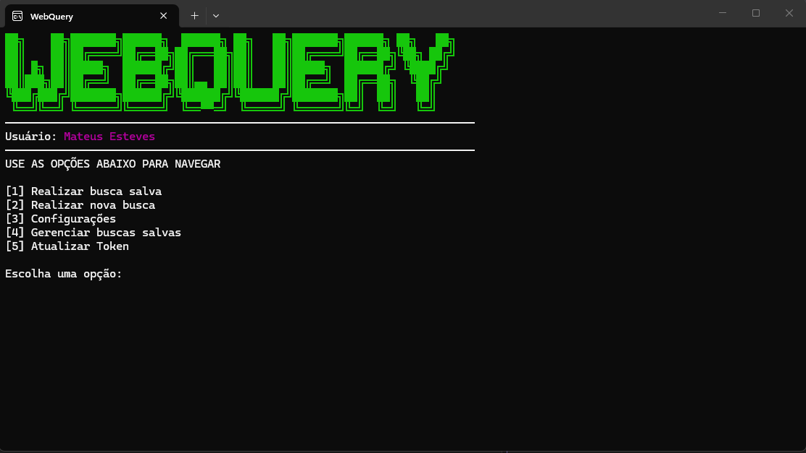
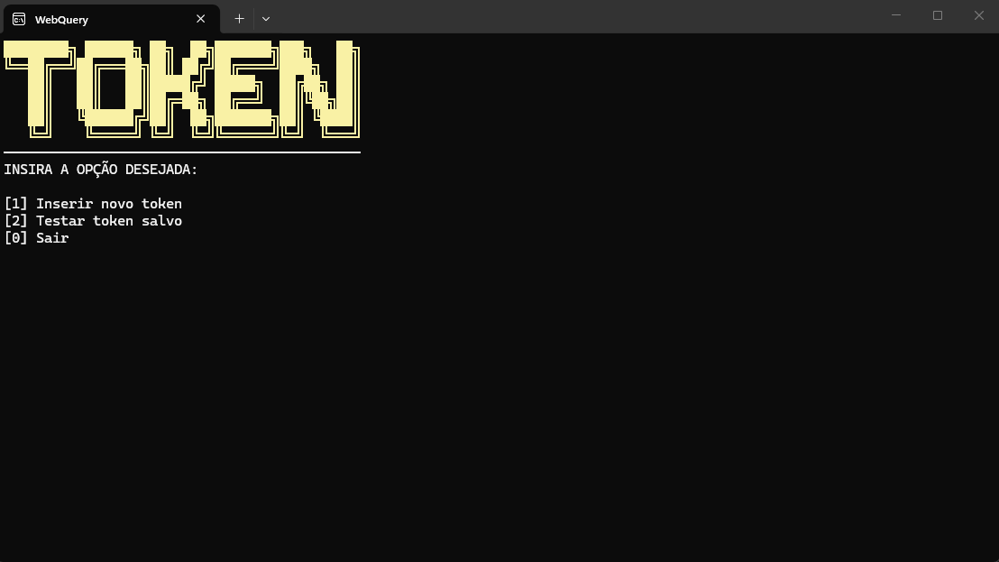
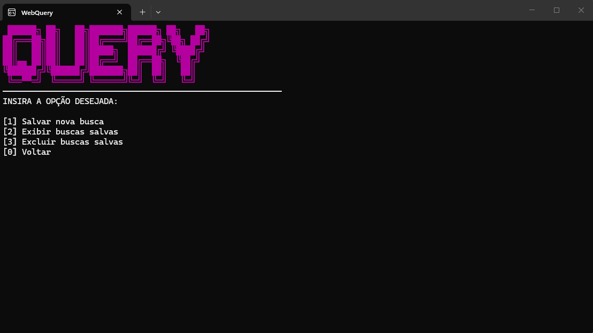
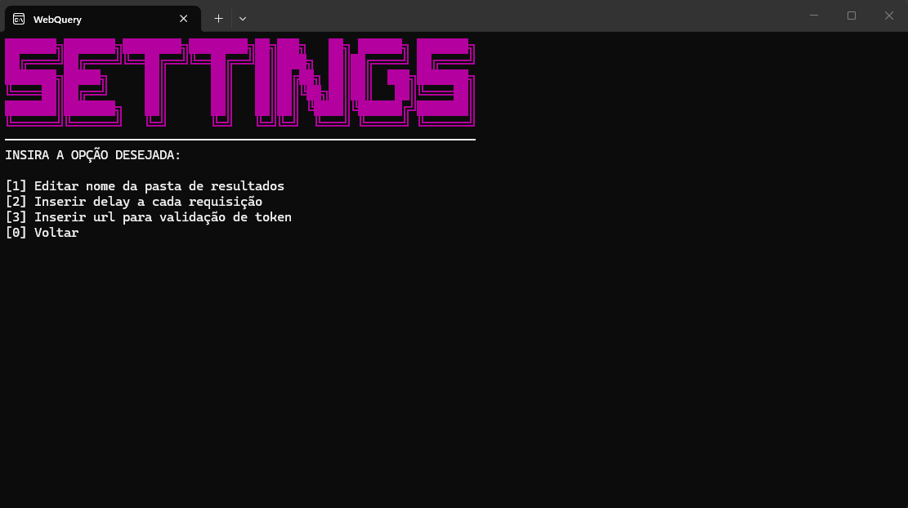
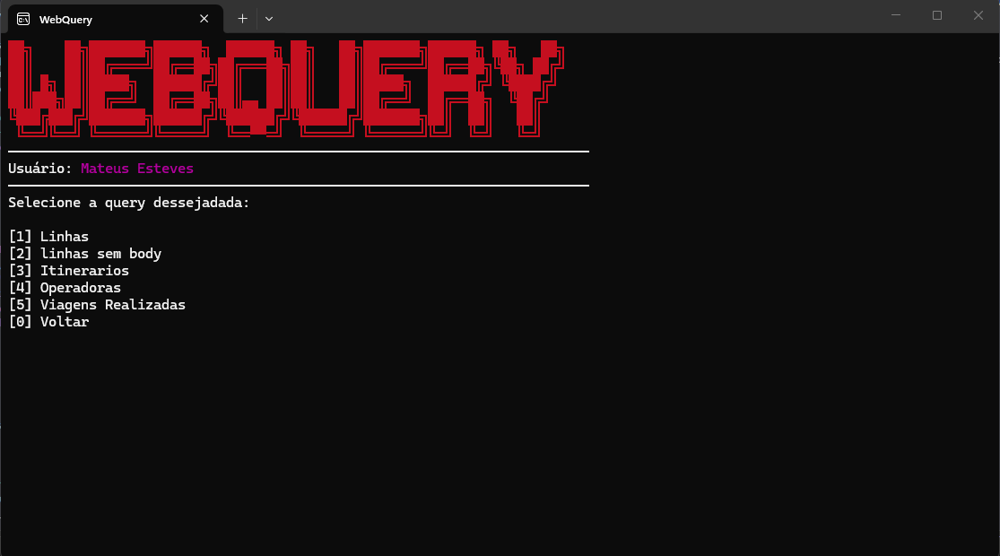

# WebQuery


Aplicação de console desenvolvida em **C#/.NET** para automatizar consultas em APIs e ferramentas corporativas, utilizando tokens de autenticação, buscas salvas, leitura de planilhas Excel e geração automática de arquivos de resultado em formatos como PDF, XLSX, KML, XML, JSON e outros.

## Visão geral

O **WebQuery** foi criado para reduzir o trabalho manual em processos repetitivos de busca de relatórios e arquivos em sistemas corporativos. A ferramenta permite cadastrar requisições, salvar consultas frequentes, executar buscas em lote com dados vindos de planilhas e gerar automaticamente os arquivos retornados em uma pasta configurável.

A aplicação funciona por menus no terminal e foi pensada para cenários operacionais onde é necessário consultar muitos registros, reaproveitar endpoints, testar tokens e salvar respostas em diferentes formatos, como PDF, XLSX, KML, XML, JSON ou qualquer outro retorno disponibilizado pela API.

## Demonstração

### Menu principal



### Gerenciamento de token



### Gerenciamento de queries



### Configurações



### Seleção de busca salva



## Funcionalidades

* Interface interativa via console.
* Menu principal com navegação por opções numéricas.
* Cadastro e atualização de token Bearer.
* Teste de token salvo.
* Execução de busca única.
* Execução de buscas salvas.
* Cadastro de queries reutilizáveis.
* Listagem de queries salvas.
* Exclusão de queries salvas.
* Persistência das configurações em `config.json`.
* Leitura de planilhas Excel usando `ClosedXML`.
* Execução de requisições `GET` e `POST`.
* Envio de body JSON em requisições `POST`.
* Processamento de respostas em JSON array.
* Conversão de respostas Base64 em arquivos.
* Geração de planilha de resultado quando a resposta retorna lista de objetos.
* Pasta de resultados configurável.
* Validação simples de licença por IP em JSON remoto.
* Identificação do usuário autorizado no menu principal.

## Problema que o projeto resolve

Em muitas empresas, determinados relatórios e arquivos precisam ser extraídos manualmente de ferramentas internas ou APIs. Esses retornos podem estar em diversos formatos, como **PDF**, **XLSX**, **KML**, **XML**, JSON ou qualquer outro tipo de arquivo.

Quando a quantidade de consultas é pequena, o processo manual ainda é possível. Porém, em grandes volumes, essa rotina se torna extremamente demorada, repetitiva e sujeita a erros humanos.

O **WebQuery** foi criado para automatizar esse tipo de demanda. A ferramenta permite configurar uma busca, reaproveitar tokens e endpoints, ler parâmetros a partir de planilhas e executar centenas de requisições em sequência, salvando os arquivos retornados automaticamente na pasta de resultados.

Em um uso real, o programa foi capaz de buscar aproximadamente **700 arquivos KML em poucos segundos**, enquanto o mesmo trabalho, feito manualmente por pessoas, levou mais de **2 meses** para ser concluído.

## Fluxo principal

1. O programa é iniciado no terminal.
2. A aplicação cria o arquivo `config.json` caso ele ainda não exista.
3. A pasta padrão `Resultados` é criada automaticamente.
4. O sistema valida a licença do dispositivo por IP.
5. O menu principal é exibido com o usuário autorizado.
6. O usuário pode atualizar o token, realizar uma nova busca ou executar uma busca salva.
7. Quando uma busca usa planilha, a primeira coluna é lida linha por linha.
8. Cada valor da planilha é usado para montar o body ou parâmetro da requisição.
9. A API é chamada usando o token salvo.
10. A resposta é processada e salva na pasta de resultados.

## Menus da aplicação

### Menu principal

```txt
[1] Realizar busca salva
[2] Realizar nova busca
[3] Configurações
[4] Gerenciar buscas salvas
[5] Atualizar Token
```

### Menu de token

```txt
[1] Inserir novo token
[2] Testar token salvo
[0] Sair
```

### Menu de queries

```txt
[1] Salvar nova busca
[2] Exibir buscas salvas
[3] Excluir buscas salvas
[0] Voltar
```

### Menu de configurações

```txt
[1] Editar nome da pasta de resultados
[2] Inserir delay a cada requisição
[0] Voltar
```

## Tecnologias utilizadas

* **C#**
* **.NET**
* **Console Application**
* **ClosedXML**
* **System.Text.Json**
* **HttpClient**
* **Excel XLSX**
* **JSON**

## Estrutura do projeto

```txt
WebQuery/
├── WebQuery/
│   ├── Program.cs          # Código principal da aplicação
│   ├── WebQuery.csproj     # Configuração do projeto .NET
│   └── iconr.ico           # Ícone da aplicação
├── .gitattributes
├── .gitignore
├── WebQuery.slnx
└── README.md
```

## Pré-requisitos

Antes de executar o projeto, tenha instalado:

* .NET SDK compatível com o projeto.
* Terminal ou Windows Terminal.
* Planilhas `.xlsx`, caso queira executar buscas em lote.
* Token válido para a API que será consultada.

## Como executar localmente

Clone o repositório:

```bash
git clone https://github.com/Mateusdev3/WebQuery.git
```

Acesse a pasta do projeto:

```bash
cd WebQuery
```

Restaure as dependências:

```bash
dotnet restore
```

Compile o projeto:

```bash
dotnet build
```

Execute a aplicação:

```bash
dotnet run --project WebQuery
```

## Arquivo de configuração

Ao iniciar pela primeira vez, o sistema cria automaticamente um arquivo `config.json` no diretório de execução.

Exemplo de estrutura:

```json
{
  "Tokenid": "",
  "Queries": [
    {
      "Name": "BuscarKML",
      "Url": "https://api.exemplo.com/endpoint",
      "Method": "POST",
      "Body": "{\"codigo\": \" \"}",
      "Sheet": "entrada.xlsx",
      "ReturnType": "kml"
    }
  ]
}
```

## Campos do `config.json`

| Campo        | Descrição                                                                 |
| ------------ | ------------------------------------------------------------------------- |
| `Tokenid`    | Token Bearer usado nas requisições.                                       |
| `Queries`    | Lista de buscas salvas.                                                   |
| `Name`       | Nome amigável da busca.                                                   |
| `Url`        | URL da API que será consultada.                                           |
| `Method`     | Método HTTP utilizado, como `GET` ou `POST`.                              |
| `Body`       | Corpo da requisição enviado para a API.                                   |
| `Sheet`      | Nome ou caminho da planilha usada como fonte de dados.                    |
| `ReturnType` | Extensão/formato do arquivo de saída, como `kml`, `png`, `xlsx` ou outro. |

## Como cadastrar uma busca salva

1. Abra o programa.
2. Escolha a opção `[4] Gerenciar buscas salvas`.
3. Escolha `[1] Salvar nova busca`.
4. Informe o nome da query.
5. Informe a URL da API.
6. Informe o método da requisição.
7. Informe o body da requisição.
8. Informe a planilha de entrada, se houver.
9. Informe o tipo de retorno esperado.
10. Execute depois pelo menu `[1] Realizar busca salva`.

## Como funciona a busca com planilha

Quando uma planilha é informada no campo `Sheet`, o sistema:

1. Abre a primeira aba do arquivo Excel.
2. Percorre as linhas utilizadas.
3. Lê o valor da primeira coluna.
4. Usa esse valor para substituir o espaço no `Body` configurado.
5. Executa a requisição para cada linha.
6. Processa a resposta retornada pela API.
7. Salva o resultado na pasta configurada.

Exemplo de body configurado:

```json
{"linhaCodExternoSigla":" "}
```

Se a planilha tiver o valor `321` na primeira coluna, a requisição será enviada como:

```json
{"linhaCodExternoSigla":"321"}
```

## Tipos de resposta tratados

### Resposta em JSON array

Quando a resposta contém uma lista de objetos JSON, o sistema agrega os dados em uma planilha de saída.

Exemplo de saída:

```txt
Resultados/Resultado.xlsx
```

### Resposta em Base64

Quando a resposta é um conteúdo Base64, o sistema limpa caracteres de escape, decodifica o conteúdo e salva o arquivo com a extensão definida em `ReturnType`.

Exemplo de saída:

```txt
Resultados/321.kml
```

## Pasta de resultados

Por padrão, os arquivos gerados são salvos na pasta:

```txt
Resultados
```

Essa pasta pode ser alterada pelo menu de configurações.

## Validação de token

O programa permite inserir um token e testar se ele está válido. O token é salvo no arquivo `config.json` e utilizado como Bearer Token nas requisições HTTP.


## Segurança e cuidados

* Não envie tokens reais para o GitHub.
* Não exponha URLs internas ou privadas em prints públicos.
* Não versione planilhas com dados sensíveis.
* Adicione `config.json`, arquivos de entrada e pasta de resultados ao `.gitignore`, caso contenham dados reais.
* Use um ambiente de teste antes de executar consultas em APIs de produção.

## Objetivo técnico

Este projeto demonstra conhecimentos em:

* Desenvolvimento de aplicações console em C#.
* Consumo de APIs REST com `HttpClient`.
* Autenticação Bearer Token.
* Manipulação de JSON com `System.Text.Json`.
* Leitura e escrita de arquivos locais.
* Processamento de planilhas Excel com `ClosedXML`.
* Execução de tarefas repetitivas em lote.
* Geração de arquivos a partir de Base64.
* Organização de configurações persistentes.
* Criação de menus interativos no terminal.

## Melhorias futuras

* Adicionar suporte completo a delay entre requisições.
* Permitir escolher a coluna da planilha usada como parâmetro.
* Permitir múltiplas variáveis no body da requisição.
* Adicionar logs detalhados de execução.
* Gerar relatório final com sucesso, erro e tempo de cada chamada.
* Criar tratamento mais detalhado para erros HTTP.
* Permitir exportar configuração de queries.
* Criptografar ou proteger o token salvo localmente.
* Adicionar suporte a headers personalizados.
* Criar instalador ou executável publicado para Windows.
* Separar o código em classes de serviço para facilitar manutenção.

## Autor

Desenvolvido por **Mateus Esteves**.

## Licença

Este projeto está sob a licença MIT. Sinta-se à vontade para usar, estudar e adaptar.
